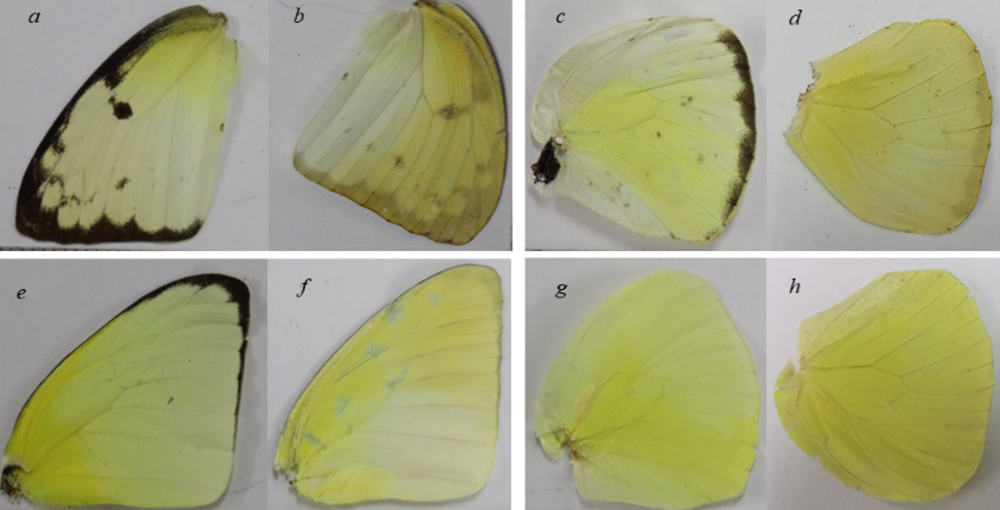
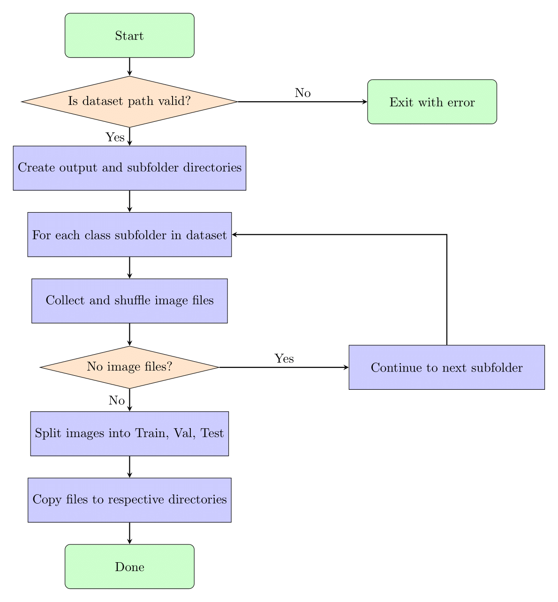
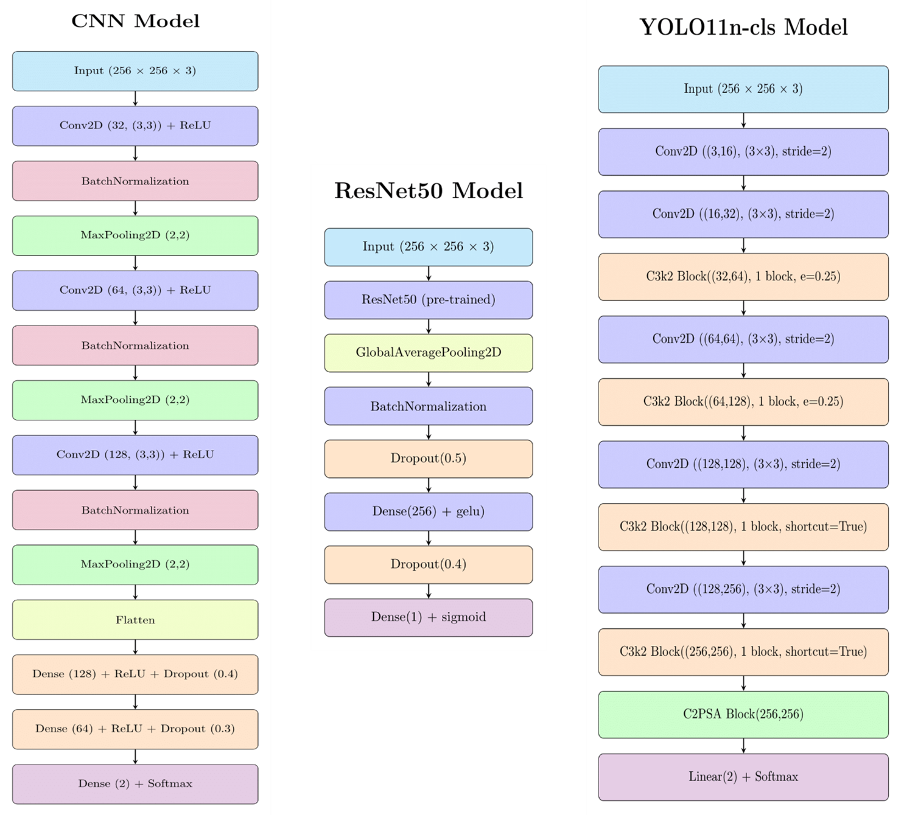
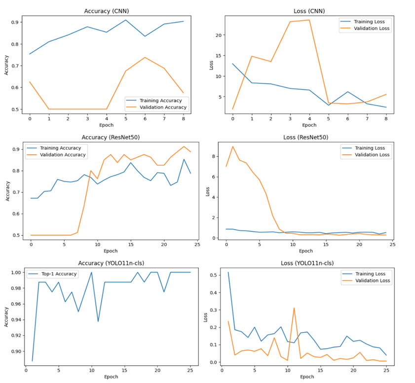
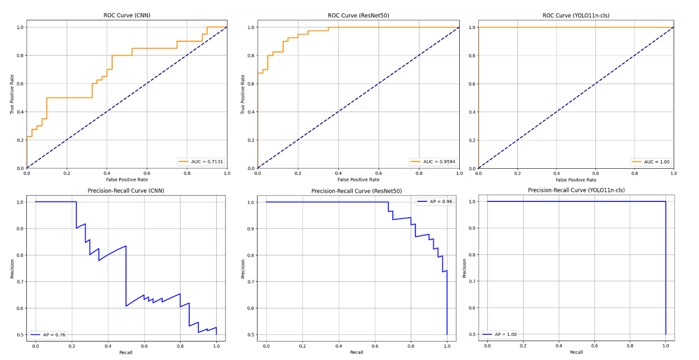
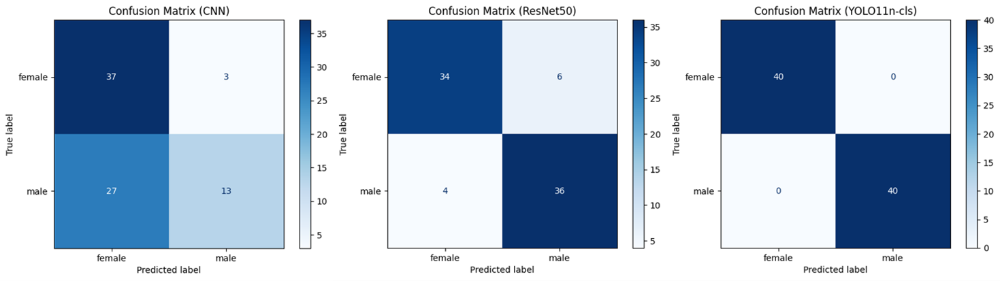
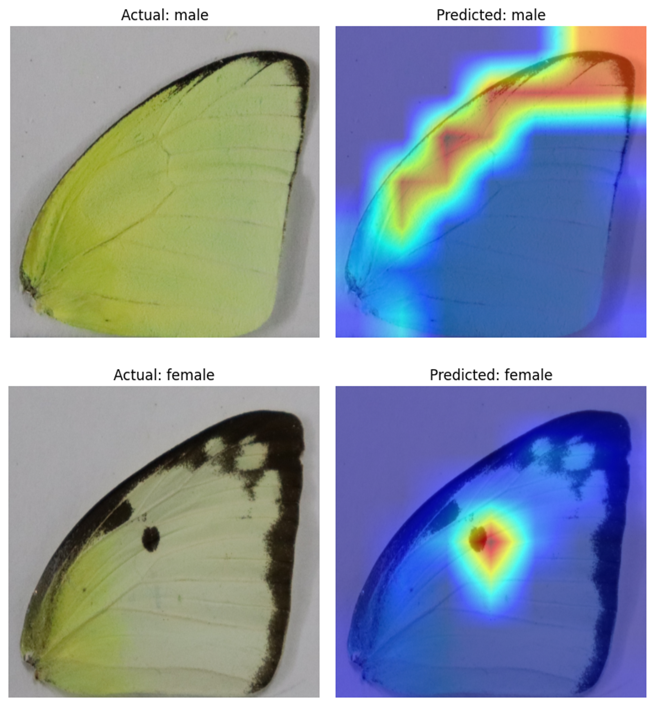

# Computational Analysis of Sexual Dimorphism in *Catopsilia pomona* via Visual Classifiers

This project explores the use of image classification techniques to analyze sexual dimorphism in the *Catopsilia pomona*, focusing on distinguishing between male and female individuals using wing images.

## Introduction

The study of sexual dimorphism, the distinct differences between males and females of the same species, is crucial in entomology. This project applies computational methods, specifically Convolutional Neural Networks (CNN), ResNet50, and YOLO11n-cls, to automate and enhance the analysis of these differences in *Catopsilia pomona*. By analyzing wing morphology, we aim to accurately classify the sex of individual butterflies, contributing to ecological studies and conservation efforts.

## Objectives

The primary objectives of this project are:

* To develop and compare the performance of CNN, ResNet50, and YOLO11n-cls models in classifying the sex of *Catopsilia pomona* from wing images.
* To evaluate the models using key performance metrics, including accuracy, recall, AUC-ROC score, and Average Precision (AP).
* To visualize and interpret the decision-making process of the models using Eigen-CAM visualization, highlighting the specific wing features that influence sexual dimorphism.

## Methodology

The methodology employed in this project consists of the following key steps:

|  Steps                 | Description                                                                                   | Visual |
|--------------------------|--------------------------------------------------------------------------------------------------|-----------|
| **Image Acquisition** | Images of *Catopsilia pomona* wings were collected from NIT Rourkela campus and prepared for analysis. |  |
| **Data Preparation** | The collected images were processed and organized into training and validation datasets.         |  |
| **Model Training**    | Three different models were trained: • Custom CNN • Fine-tuned ResNet50 • YOLOv11n-cls |  |

---

## Results

1. The models were evaluated based on accuracy, recall, AUC-ROC, and Average Precision.

| Model          | Visualization |
|----------------|--------------------------------------------|
| **Accuracy/Loss Curve**   |  |
| **AUC-ROC and Precision-Recall Curve** |  |
| **Confusion Matrix** |   |

---

2. Eigen-CAM visualizations revealed that the models focus on different wing regions to make predictions. For example, the models often highlighted dark spots on female wings and the wing margin characteristics on male wings.

## Conclusion

The CNN showed low accuracy and recall, its AUC-ROC and AP scores suggest it may not be reliably distinguishing between male and female butterflies. ResNet50 provides a good balance of accuracy and recall and its AUC_ROC and AP scores shows a genralized relation after hyper parametric tunning. YOLO11n-cls perfect scores indicate overlearning, suggesting a need for a larger and more diverse dataset to improve generalization.

Further research could involve expanding the dataset, including more butterfly species, and developing real-time monitoring tools for ecological studies.
